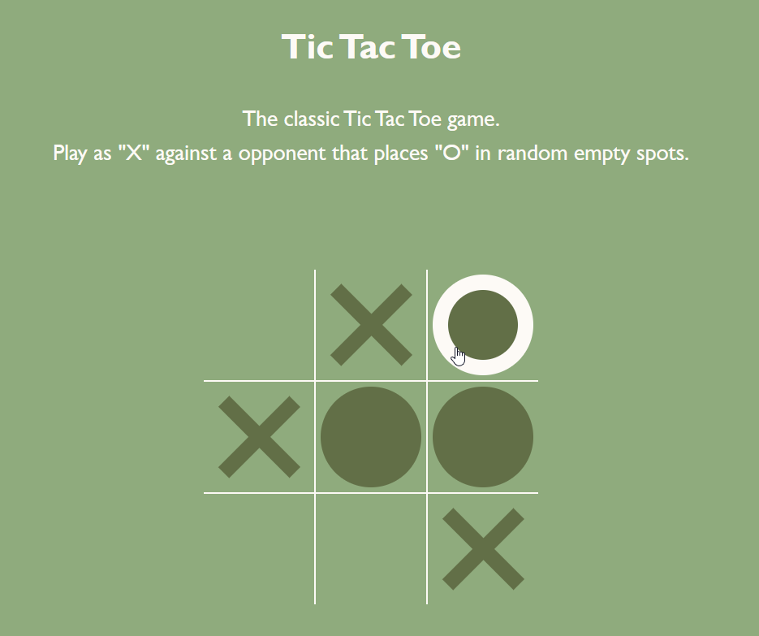
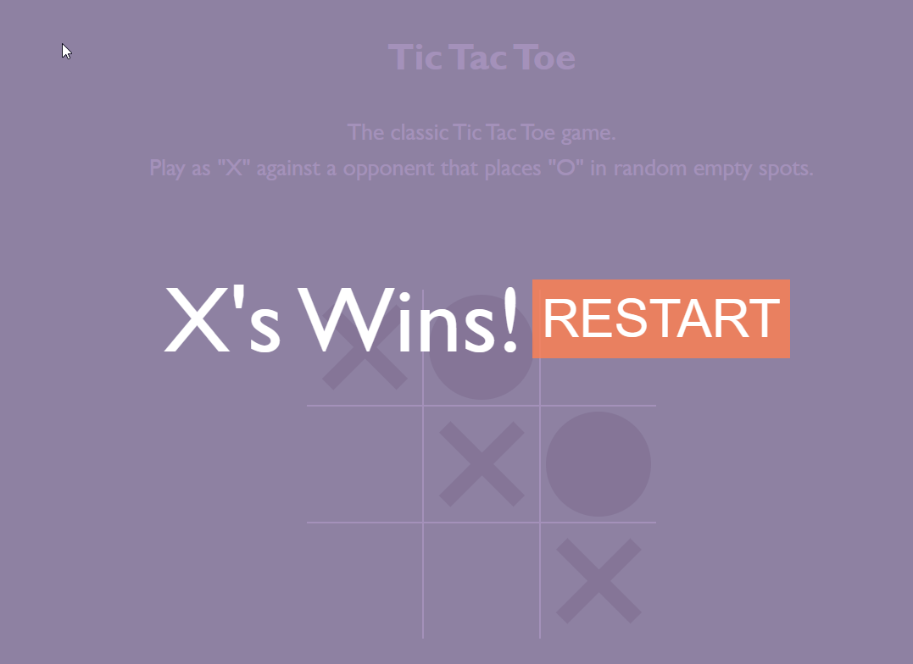

# 🎯 Tic Tac Toe

> A classic **Tic Tac Toe** game where two players take turns placing their marks (X or O) on a 3×3 grid. Built with **HTML**, **CSS**, and **JavaScript**.

---

## 📑 Table of Contents

- [General Info](#general-info)
- [Screenshots](#screenshots)
- [Technologies](#technologies)
- [Setup](#setup)
- [Code Examples](#code-examples)
- [Features](#features)
- [To-Do List](#to-do-list)
- [Project Status](#project-status)
- [Contact](#contact)

---

## General Info

**Tic Tac Toe** is a simple web-based implementation of the classic paper-and-pencil game for two players. Players alternate turns placing either an “X” or an “O” on a 3×3 grid. The first to align three of their marks horizontally, vertically, or diagonally wins the game. The game handles turn switching, win/draw detection, and board resetting through DOM manipulation.

---

## Screenshots




---

## Technologies

- HTML5
- CSS3
- JavaScript (Vanilla)
- Visual Studio Code (IDE)

---

## Setup

1. Clone this repository:

   ```sh
   git clone https://github.com/yourusername/tic-tac-toe.git
   ```

2. Navigate to the project folder:

   ```sh
   cd tic-tac-toe
   ```

3. Open index.html in your browser.

---

## Code Examples

```js
placeSymbol(cell, currentClass);
state.inputResults[cell.id] = currentClass;
const winner = hasWinner(state.winningPatterns, state.inputResults);
const draw = isDraw(state.inputResults);
```

## Features

- Two-player mode (X vs. O)

- Detects win conditions and draws

- Message display for game results

- Board resets for a new game

## To Do

- Add single-player mode vs. computer

## Project Status

Project is: ✔️ Base project completed

## Contact

By [boba-milktea](https://github.com/boba-milktea)
